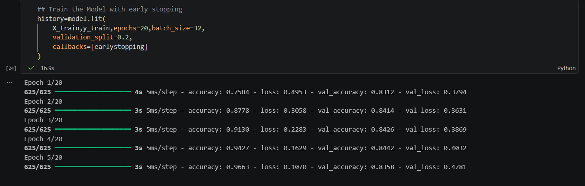
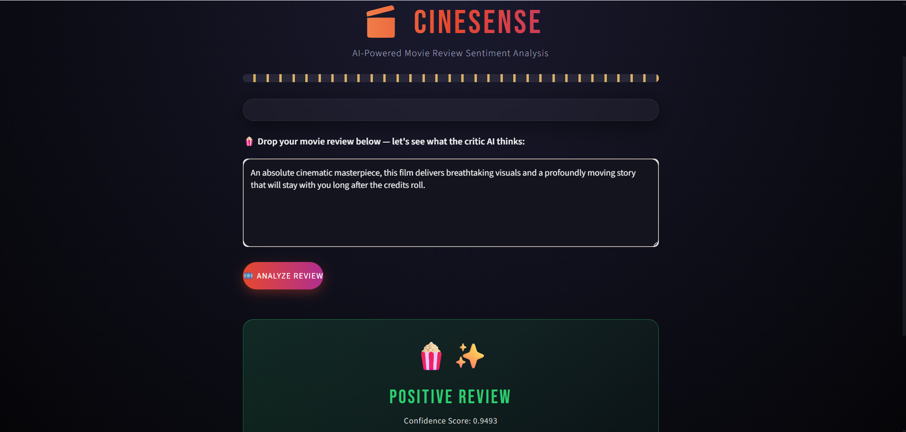
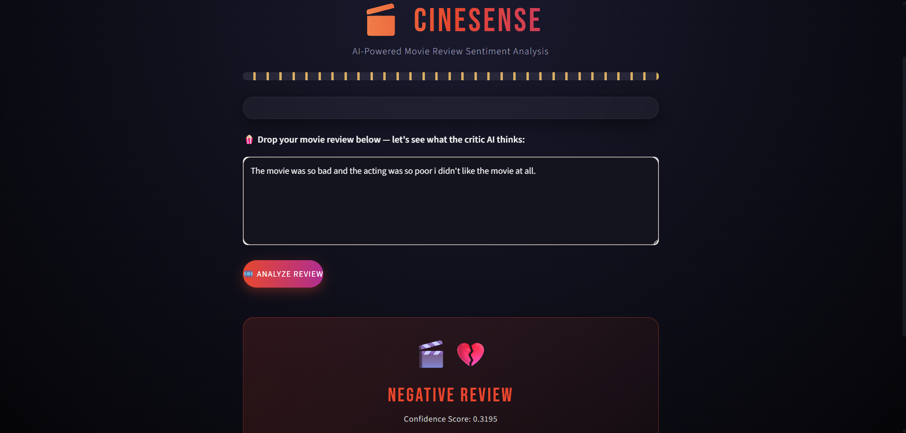

# 🎬 CineSense — Movie Review Sentiment Analysis

A **Simple RNN**-based deep learning model that classifies movie reviews as **Positive** or **Negative**, trained on the IMDB dataset and deployed with an interactive **Streamlit** web app.

---

## 📌 Overview

This project uses a **Simple Recurrent Neural Network (SimpleRNN)** built with TensorFlow/Keras to perform binary sentiment classification on movie reviews. The trained model is served through a custom-styled Streamlit interface where users can type in any movie review and instantly get a sentiment prediction along with a confidence score.

---

## 🧠 Model Architecture

```
Embedding Layer  →  SimpleRNN  →  Dense (Sigmoid)
```

- **Dataset:** IMDB Movie Reviews (Keras built-in dataset, 50,000 reviews)
- **Vocabulary size:** 10,000 most frequent words
- **Max sequence length:** 100
- **Recurrent layer:** SimpleRNN with `tanh` activation
- **Regularization:** Dropout + Recurrent Dropout to prevent overfitting
- **Output layer:** Single neuron with sigmoid activation (binary classification)
- **Loss function:** Binary Crossentropy
- **Optimizer:** Adam
- **Callback:** EarlyStopping (monitors `val_loss`, restores best weights)

---

## 📊 Training Results

The model was trained for up to 20 epochs with EarlyStopping enabled, which halted training once validation loss stopped improving.

**Final performance:**
- ✅ Validation Accuracy: **~84%**
- ✅ Validation Loss: **~0.36**

### 🖼️ Training Screenshot



---

## 💻 Streamlit App

The app features a custom cinema-themed UI where users can paste in a review and click **"Analyze Review"** to get an instant sentiment prediction, along with the submitted review displayed alongside the result for easy reference.

### ✅ Positive Review Example

<!-- Add your positive review screenshot below -->


### ❌ Negative Review Example

<!-- Add your negative review screenshot below -->


---

## 🛠️ Tech Stack

- **Python**
- **TensorFlow / Keras** — model building & training
- **Streamlit** — web app / UI
- **NumPy**

---

## 📂 Project Structure

```
├── IMDB_Dataset.ipynb    # Trained the model with Simple RNN
├── prediction.ipynb      # Load the model and predict
├── app.py                # Streamlit web app
├── simple_rnn.h5          # Saved the Trained SimpleRNN model
├── images/                # Screenshots used in this README
│   ├── training_ss.png
│   ├── positive_review_ss.png
│   └── negative_review_ss.png
├── requirements.txt
└── README.md
```

---

## 🚀 How to Run Locally

1. Clone the repository
   ```bash
   git clone https://github.com/arjun612410/CineSense-Movie-Review-Sentiment-Analysis
   cd CineSense-Movie-Review-Sentiment-Analysis
   ```

2. Install the dependencies
   ```bash
   pip install -r requirements.txt
   ```

3. Make sure `simple_rnn.h5` (the trained model) is in the same directory as `app.py`

4. Run the Streamlit app
   ```bash
   streamlit run app.py
   ```

5. Open the local URL shown in the terminal and start analyzing movie reviews! 🍿

---

## 🧩 Key Learnings & Challenges

While building this project, a few important deep learning insights came up:

- **ReLU + SimpleRNN is unstable** — using `relu` as the recurrent activation caused exploding gradients (loss spiking into the thousands mid-training). Switching to `tanh` (the standard choice for RNNs) stabilized training completely.
- **Overfitting is easy to hit** — early experiments showed ~99% training accuracy but only ~82% validation accuracy, a clear sign of memorization rather than generalization. Adding **Dropout**, **Recurrent Dropout**, and **EarlyStopping** brought training and validation performance much closer together, resulting in a more honest, generalizable model.
- **Sequence length matters** — reducing `max_len` helped shorten the path gradients had to travel through the recurrent layer, further improving training stability.

---

## 🙌 Acknowledgements

Built as a learning project to understand RNNs, gradient stability, and overfitting through hands-on experimentation on the IMDB sentiment dataset.